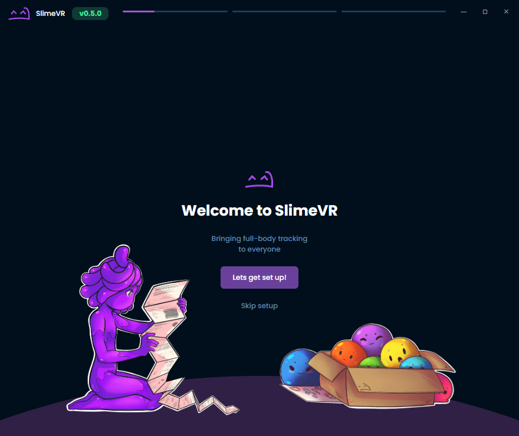
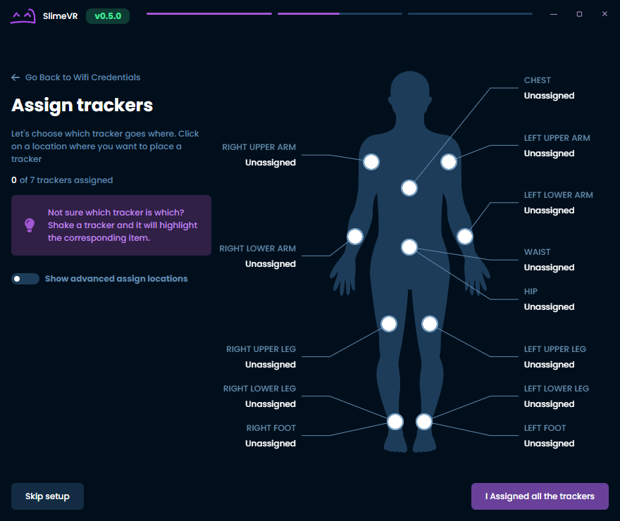
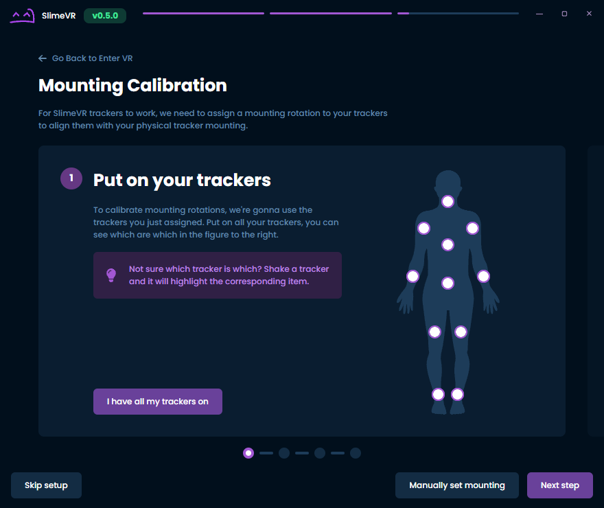

# Installing the server and connecting your trackers
{:.no_toc}

This guide should help you set up SlimeVR trackers and software.

## Install the latest SlimeVR Installer
The latest [SlimeVR Installer can be found here.](https://github.com/SlimeVR/SlimeVR-Installer/releases/latest/download/slimevr_web_installer.exe) Download it and install it, this installer can be used to update the server software in the future.

## Test your trackers
Turn each tracker on and see if they work.

Each tracker should blink an LED briefly on startup, and then blink every few seconds to indicate its status as follows:

| Number of blinks | Status                                             |
| :--------------: |:-------------------------------------------------- |
| 1                | Tracker is ready                                   |
| 2                | Connecting to SlimeVR server                       |
| 3                | Connecting to wifi                                 |
| 5                | IMU error                                          |

If a tracker doesn't start up, try charging it. Connect the tracker via USB port to your PC or any USB charger. A red LED light should light up to indicate that it's charging. A green LED or blue LED light means it's fully charged (LED might be a different colour depending on your charging board). Try turning the tracker on during charging to see if it works.

**Please note that as a rule, DIY trackers should be kept off while charging outside of this specific case.**

## IMU calibration

If you have MPU6050 or MPU6500-based trackers, make sure that when you turn on your tracker it's lying on a flat surface. The sensors need to calibrate for 20-30 seconds in a stable environment. This should be done every time you turn on your trackers. Failing to do so will result in an increased rate of drift.

If you have an MPU9250, a BMI160, or an MPU+QMC5883L you need to calibrate the IMU before it will work correctly. This calibration only needs to be done once. You can only calibrate one IMU at a time, so if you have any extensions, they will also need to be calibrated. To calibrate your IMU, plug in your microcontroller (D1 Mini, NodeMCU, or other) and open the SlimeVR server, and click "Settings", and "Serial Console" under Utilities. Then, flip the IMU you want to calibrate upside down and press the reset button on your micro controller. You should see a message indicating that you need to flip the IMU right side up to begin calibration. Upon flipping the IMU over, calibration should begin. To successfully calibrate your IMU you need to gently rotate the IMU in all 3 axes. After approximately 60 seconds has passed, the tracker should be successfully calibrated and will begin to show rotation in the SlimeVR server.

Other IMUs, such as the BNO085 or ICM20948 do not require any specific manual calibration and can be used immediately.

## Check that the driver loads and connects
{:.no_toc}

1. Start SteamVR, go to **Settings** > **Manage Add-Ons**. Check if SlimeVR exists here, set it to **On**.

   
1. Start the SlimeVR Server through the start menu via the "SlimeVR Server" shortcut.
1. Restart SteamVR. Now you should see 3 trackers active in SteamVR:

   
1. In SlimeVR Server, you should see the rotation change for your headset and controllers as you move them around:

   

## Connecting trackers

> **Note:** If you are using DIY trackers with hardcoded the WiFi credentials or phones with owoTrack, you can skip to assigning your trackers. However, if you hardcoded the WiFi credentials and are having trouble connecting these steps may still be helpful for diagnosing the issue.

1. Open the SlimeVR Server and click **Setup Wizard**.

1. Input your WiFi credentials, so that your tracker can connect to WiFi, then click **Submit**

1. Plug in a tracker one at a time. You should then see your tracker appear after a little while. Click **I connected all my trackers** once you're done.

1. Hover over and click on the unassigned tracking points that you want to use. Shaking your tracker will highlight it. Click **I Assigned all the trackers** once you're done.

1. Congratulations! You connected all of your trackers, but there's still more left to do. Click **I'm ready** once you have your trackers on.

1. At this time, automatic mount calibration isn't ready, so click **Manually set mounting**. With your trackers on, click either **Left**, **Right**, **Front**, or **Back** depending on how you have your trackers mounted. There's no right or wrong answers, just whatever feels most comfortable for you! Click **Next step** once you've set the mounting orientation of all of your trackers. More information can be found on mounting on the [Putting on your trackers page](https://docs.slimevr.dev/server-setup/putting-on-trackers.html).

1. At this time, the reset tutorial isn't ready, but you can check [the page on reset bindings](https://docs.slimevr.dev/server-setup/setting-reset-bindings.html) for more information in the meantime. Simply click **Continue**.

1. You'll want to be in VR for this final step. This involves wiggling around with your feet planted so that your body proportions can be determined. Simply follow the instructions shown. Be sure to verify your results and that nothing is obviously incorrect like having a neck length of 100 cm! Click **Continue** once you're done.

1. You're done! If you've made it through all that, you should be ready to start using SlimeVR!

### Troubleshooting

If all trackers don't show up, this can be caused by Windows Firewall blocking the connection. To fix this, go to SlimeVR Server folder and run `firewall.bat` as administrator. There are additional steps that can be taken on the [common issues page](../common-issues.md#the-trackers-are-connected-to-my-wifi-but-dont-turn-up-on-slimevr) if this does not work.

If some trackers don't show up, try turning them off and on again. You can rotate tracker around and see it change rotation in the server to figure out which tracker is which.

If some trackers don't change their rotation as you move them (including extensions), or display 0 0 0 rotation, try turning them off and on again, usually it should fix the issue.

If any tracker displays ERROR as it's status, or have orange and blue light permanently on, that's not good. Try restarting them and see if it helps. If not, contact Eiren.

***Next step - [Configuring the trackers](configuring-trackers.md)***

*Created by Eiren, edited by adigyran#1121, CalliePepper#0666, Emojikage#3095 and NWB#5135, styled by CalliePepper#0666.*